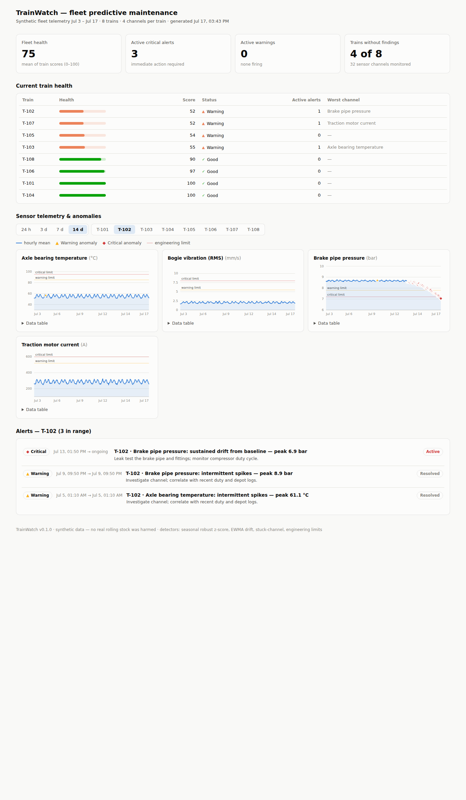

# TrainWatch — predictive maintenance dashboard

A predictive-maintenance platform for a train fleet: synthetic sensor data with
injected faults → anomaly detection → maintenance alerts → interactive web
console.

Two frontends available:
- **Static HTML** (`output/dashboard.html`) — single file, no build, works offline
- **React web app** (`frontend/`) — modern UI, wired to Python API backend



## Features

**Anomaly Detection:**
- Seasonal robust z-score (spikes)
- EWMA drift tracking (progressive wear)
- Stuck-channel detection (sensor failure)
- Engineering limits (hard thresholds)

**Alert System:**
- Episode-based alerts (no point spam)
- Automated maintenance recommendations
- Health scores (0–100 per train)
- Active alert tracking

**APIs:**
- `/api/fleet` — complete fleet data
- `/api/train/<id>` — specific train detail
- `/api/alerts?severity=crit&train_id=T-101` — filtered alerts
- `/api/sensor/<train>/<sensor>` — time-series data
- OpenAPI 3.0 specification included

**Web Console:**
- Fleet health summary (stat tiles)
- Per-train health meters & status
- Anomaly-flagged sensor charts (4 channels × time range)
- Alert feed with recommendations
- Auto-refresh (30s, respects prefers-reduced-motion)
- CSV export (alerts & health)
- Light/dark mode

**Deployment:**
- Docker Compose for local dev (`docker-compose up`)
- GitHub Actions CI (test, lint, build)
- Gunicorn + static build for production
- Single-container Docker option

## Quick start

### Option 1: Static HTML dashboard (no build, no dependencies)

```bash
pip install -r requirements.txt
python -m trainwatch
```

Open `output/dashboard.html` in a browser. It's a single self-contained file.

### Option 2: React web app + API (modern UI, scalable)

**With Docker Compose (recommended):**
```bash
docker-compose up
```

Open `http://localhost:5173` for the frontend, `http://localhost:5000` for the API.

**Or manually:**
```bash
# Terminal 1 — Backend API
pip install -r requirements.txt
python api.py

# Terminal 2 — Frontend
cd frontend
npm install
npm run dev
```

See **[SETUP.md](SETUP.md)** for production deployment.

### What to explore

1. **Dashboard** — view fleet health, train detail, sensor charts
2. **Drill down** — click a train in the sidebar to see its alerts
3. **Auto-refresh** — toggle "Auto-refresh (30s)" to poll for updates
4. **Export** — (coming: right-click alerts to export to CSV)
5. **API** — curl `http://localhost:5000/api/fleet | jq` or open OpenAPI spec in Swagger UI

## Documentation

- **[SETUP.md](SETUP.md)** — deployment (Docker, production)
- **[ARCHITECTURE.md](ARCHITECTURE.md)** — design, extending, scaling
- **[CONTRIBUTING.md](CONTRIBUTING.md)** — development guide
- **[openapi.yml](openapi.yml)** — API specification

## What's in this repo

```
trainwatch/              Python backend (generation, detection, alerts)
frontend/                React web console (TanStack Start, Tailwind, Recharts)
api.py                   Flask API server
tests/                   pytest suite (30 tests)
.github/workflows/       GitHub Actions (CI/CD)
docker-compose.yml       Local dev (one command)
openapi.yml              API specification
SETUP.md                 Deployment guide
ARCHITECTURE.md          Design & extending
CONTRIBUTING.md          Development guide
```

## What it does

### 1. Synthetic telemetry (`trainwatch/generate.py`)

8 trains × 4 sensor channels × 14 days at a 10-minute cadence (~64k samples).
Healthy behaviour is a daily duty cycle (morning/evening service peaks) plus
per-train character offsets and measurement noise. Four fault narratives are
injected on top:

| Train | Channel | Fault pattern |
|-------|---------|---------------|
| T-103 | Axle bearing temperature | accelerating drift — progressive bearing wear |
| T-105 | Bogie vibration (RMS) | intermittent spikes — developing wheel flat |
| T-102 | Brake pipe pressure | slow downward drift — air leak |
| T-107 | Traction motor current | frozen signal — failed transducer |

### 2. Anomaly detection (`trainwatch/detect.py`)

Each channel is scored against a baseline fitted on its own leading (healthy)
window:

- **Seasonal robust z-score** — hour-of-day medians + MAD scale, so the daily
  duty cycle isn't mistaken for a fault; flags *spikes*.
- **EWMA drift tracking** — control limits in units of the EWMA's own sigma;
  flags slow *drifts* days before any hard limit is crossed (the point of
  predictive maintenance — there's a test asserting exactly that).
- **Stuck-channel check** — rolling variance collapsing to zero flags a frozen
  transducer that limit checks would never catch.
- **Engineering limits** — conventional absolute warn/critical thresholds.

### 3. Alerts & health (`trainwatch/alerts.py`)

Consecutive anomalous samples merge into **episode alerts** (flicker-bridging,
no point spam) carrying severity, detector kind, time window, peak reading and
a maintenance recommendation. Per-train **health scores** (0–100) weight
active criticals heaviest, with diminishing penalties for repeat episodes on
the same channel.

### 4. Dashboard (`trainwatch/dashboard.py`)

One self-contained HTML file: fleet stat tiles, per-train health meters and
status, hourly sensor charts with anomaly markers and engineering-limit lines,
crosshair tooltips, per-chart data tables, time-range presets (24 h / 3 d /
7 d / 14 d), a train switcher (worst train pre-selected), the alert feed, and
automatic light/dark mode.

## Outputs

| File | Contents |
|------|----------|
| `output/dashboard.html` | the dashboard (open in a browser) |
| `output/telemetry.csv` | raw synthetic telemetry (tidy: timestamp, train, sensor, value) |
| `output/anomalies.csv` | every anomalous sample with scores, detectors and severity |
| `output/alerts.csv` | deduplicated alert episodes |

## Tests

```bash
python -m pytest
```

Covers generator determinism and fault signatures, detector hits and
false-positive behaviour (including "drift detected well before the hard
limit"), alert episode merging, health-score ranking, and the dashboard
payload shape.

## Project layout

```
trainwatch/               Python backend
├─ config.py            fleet, sensor specs, fault narratives
├─ generate.py          synthetic telemetry generator
├─ detect.py            statistical anomaly detectors
├─ alerts.py            episode alerts & health scores
├─ dashboard.py         HTML dashboard renderer
└─ __main__.py          pipeline CLI

api.py                   Flask API server (serves /api/fleet)
SETUP.md                 Deployment guide

frontend/                React + TanStack Start
├─ src/routes/          page routes (fleet console, etc.)
├─ src/components/      UI components (charts, train list)
├─ src/hooks/           useFleetData (API fetcher)
├─ src/lib/             config, simulation (fallback)
└─ package.json         dependencies

tests/                   pytest suite
output/                  generated telemetry & dashboard
```

## Architecture

```
                    Static HTML
                   (single file)
                        │
Python → Generate       ├─→ JSON payload
Backend  + Detect       │   (embedded)
         + Score        │
                        ├─→ Serve as API
                        │
                  React Frontend
                   (http://localhost:5173)
                        │
                   fetch /api/fleet
                        │
                   Display & filter
```
